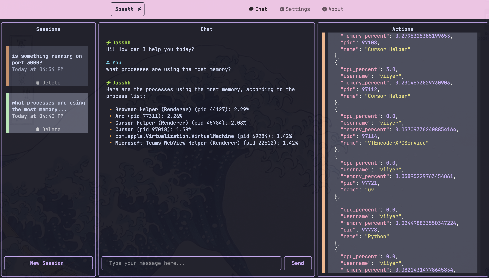

<div align="center">

# 🗲 &nbsp; *Dasshh* &nbsp; 🗲

***An AI Agent on your terminal, to preserve your brain juice.***

Dasshh is a terminal-based AI agent that allows you to interact with your computer using natural language.

</div>

## ✨ Features 

- Interactive & minimal chat UI
- Chat with your personal assistant on your terminal
- Perform actions on your computer with plain English
- Extensible with your own tools

## 📸 Screenshots

### Light Mode


### Dark Mode


## 📦 Installation

### Using `uv`

```bash
brew install uv  # macOS
uvx dasshh
```

### Prefer `pipx`?

```bash
pipx install dasshh
```

### Initial Setup

Before running the app, you need to initialize the configuration file:

```bash
dasshh init-config
```

This will create a configuration file at `~/.dasshh/config.yaml`. You need to edit this file to set your API key and other preferences:

```yaml
# Edit the file to set your model API key
model:
  name: gemini/gemini-2.0-flash
  api_key: YOUR_API_KEY_HERE
```

### Running the app

```bash
dasshh
```

## 🤝 Contributing

Contributions are welcome! Please open an issue with your suggestions or feature requests.

## 🧰 Development

### Clone the repository

```bash
git clone https://github.com/vgnshiyer/dasshh.git
cd dasshh
```

### Install dependencies

```bash
uv sync
```

### Run the app

```bash
python -m dasshh
```

## 📝 License

This project is licensed under the MIT License. See the [LICENSE](LICENSE) file for details.

