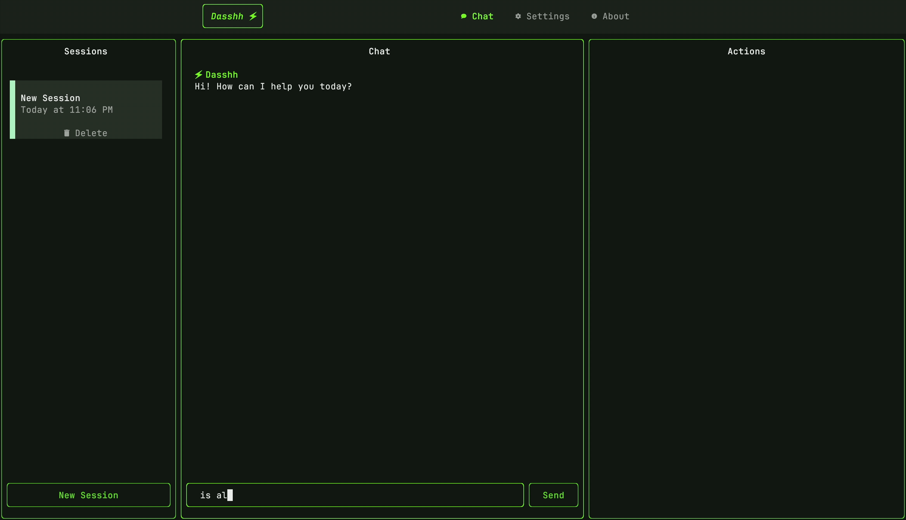

# Quick Start

This little guide will help you get started with Dasshh.

## Configure a Model

Dasshh uses LLM models via the [litellm](https://docs.litellm.ai/docs/providers) library, which provides a unified interface to various AI providers.

Setup your config file by running:

```bash
dasshh init-config
```

This will create a config file at `~/.dasshh/config.yaml`.

To get started, you need to configure at least one model. The new configuration format supports multiple models:

1. `model_name`: A unique identifier for your model
2. `litellm_params.model`: The model provider and model name
3. `litellm_params.api_key`: Your API key for the chosen provider

**Example:**

```yaml
dasshh:
  selected_model: my-gemini  # Select which model to use

models:
  - model_name: my-gemini
    litellm_params:
      model: gemini/gemini-2.0-flash
      api_key: <your-google-AI-studio-api-key>
```

!!! note "Automatic Migration"
    If you have an existing config file with old format (supporting only one model), Dasshh will automatically migrate it to the new format when you start the application.

### Multiple Models

You can configure multiple models and switch between them:

- **In the config file**: Set `dasshh.selected_model` to the `model_name` you want to use
- **In the UI**: Use `Ctrl+P` to quickly switch between configured models
- **In Settings**: Use the visual interface to add, edit, and manage your model configurations

You can also set the model name and API key in the settings menu.


!!! tip
    Checkout the list of supported models and providers [here](https://docs.litellm.ai/docs/providers).

## Launch Dasshh

Once you have configured the model and your API key, you can launch Dasshh by running:

```bash
dasshh
```

This will open the Dasshh interface in your terminal.

## Basic Interaction

Dasshh provides a conversational interface to interact with your computer.



You can:

1. Ask questions
2. Request information about your system
3. Execute commands on your behalf

to name a few.

More capabilities will be added in the future, across different applications. If you have any suggestions for new tools, please [open an issue](https://github.com/vgnshiyer/dasshh/issues).

### Example Questions

Here are some examples of what you can ask Dasshh to do:

```
# Ask for information
1. What's the current CPU usage?
2. Show me the top memory-intensive processes

# File operations
1. List files in my downloads folder
2. Create a new directory called "projects" in the current directory
```

## Terminating Dasshh

To exit Dasshh, you can press `Ctrl+C` to terminate the application.
