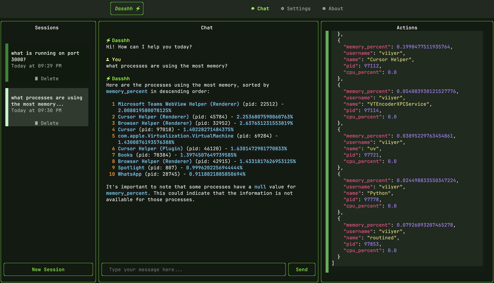

# Basics

Dasshh is a terminal-based AI assistant that helps you interact with your computer using natural language. Here's what you need to know to get started.

## Core Components

### Chat Interface

The main component you'll interact with is the chat interface, which allows you to:

With a focus on simplicity, Dasshh's chat interface is divided into three main panels:



### Sessions Panel

The Sessions Panel helps manage your conversation history.


- Displays all your previous chat sessions
- Allows you to switch between different conversations
- Shows your last message on the session card
- Lets you create new sessions or delete existing ones

### Chat Panel

The Chat Panel is the main area where your conversation happens.


- Shows the conversation history between you and the assistant
- Displays your messages and the assistant's responses
- Includes an input box at the bottom where you type your messages

### Actions Panel

The Actions Panel shows detailed information about tools used by the assistant.


- Lists all the tools called during the current session
- Shows the parameters passed to each tool
- Displays the results returned by each tool

## AI Assistant

The AI assistant is the brain of Dasshh that:

- Understands your requests
- Provides helpful responses
- Determines when to use tools to accomplish tasks

!!! tip
    You can update the default `system_prompt` in the config file to change the behavior of the AI assistant.

## Tools

Tools are nothing but the functions that the AI assistant can use to perform actions on your computer. You can find the list of tools [here](abilities.md).


Additionally, Dasshh allows you to build your own tools. You can find the guide [here](own-tools.md).

**Future Plans**

- MCP support
- API call tools

## How It Works

1. You type a request in natural language
2. The AI assistant interprets what you want to do
3. If needed, the assistant uses tools to perform actions on your computer
4. Results are displayed in the chat interface

## Example Interactions

```bash
# system information
What's my current CPU and memory usage?

# file operations
Create a new folder called "projects".

# process management
Which process is using the most memory?
```

## Getting Help

If you need help while using Dasshh, simply ask questions like `What can you do?`.


The assistant will guide you through the available features and capabilities. 

## Important Paths

| Path | Description |
|------|-------------|
| `~/.dasshh/config.yaml` | Dasshh configuration file |
| `~/.dasshh/db/dasshh.db` | Dasshh database |
| `~/.dasshh/logs/dasshh.log` | Dasshh logs file |