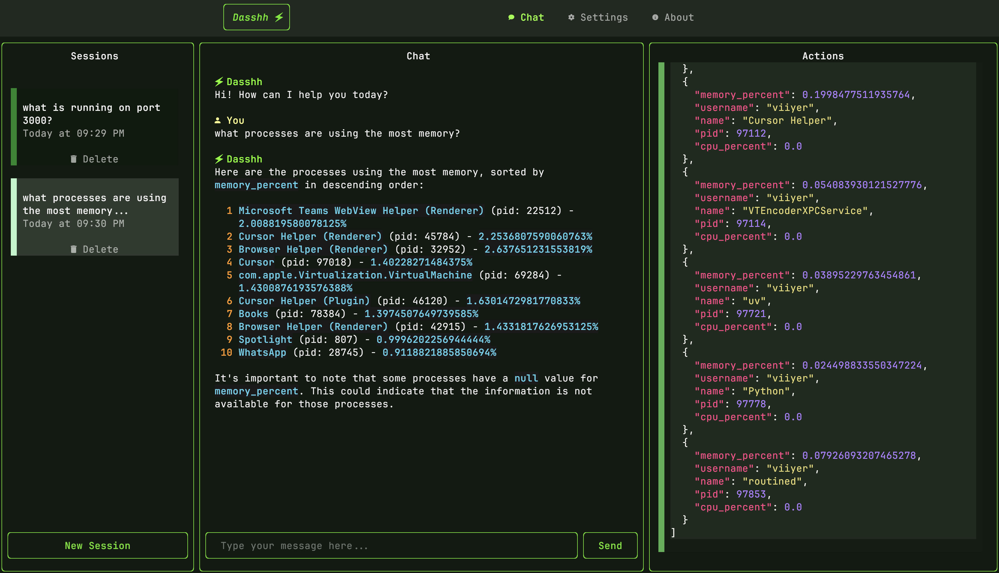

# Dasshh

<h3 style="font-weight: bold;"> An AI Agent on your terminal, to preserve your brain juice. </h3>

Dasshh is an open source tui-application built with [textual](https://textual.textual.sh/) that allows you to interact with your computer using natural language.

!!! note
    This project is still in early development. Suggestions and contributions are welcome!

<h2 style="margin-top: 60px;">Features</h2>

    

        

            <h3>Natural Language Computer Control</h3>
        

        

            
        

        <ul>
            <li>Execute system commands with plain English</li>
            <li>Manage files and directories conversationally</li>
            <li>Get real-time system information</li>
            <li>Automate repetitive tasks</li>
        </ul>
    

    

        

            <h3>Interactive & Minimal Chat UI</h3>
        

        

            
        

        <ul>
            <li>Clean, distraction-free interface</li>
            <!-- <li>Easy navigation with keyboard shortcuts</li> -->
            <li>Syntax highlighting for code snippets</li>
            <li>Multiple themes to choose from</li>
            <li>Persistent chat memory across sessions</li>
        </ul>
    

    

        

            <h3>Extensible Tool System</h3>
        

        

            
        

        <ul>
            <li>Add custom tools easily</li>
            <li>Integrate with your existing workflows</li>
            <li>MCP Support (Coming Soon)</li>
            <li>Share tools with the community</li>
        </ul>
    

    

        

            <h3>Terminal-Native Experience</h3>
        

        

            
        

        <ul>
            <li>Works where you already work - your terminal</li>
            <li>Lightweight and fast</li>
            <li>Cross-platform compatibility</li>
            <li>No GUI dependencies</li>
        </ul>
    

<h2>Get Involved</h2>

Dasshh is evolving rapidly and your feedback is essential to its development. The future direction of this project will be heavily influenced by community input.

<h3>How to Contribute</h3>

- [Try it out](https://github.com/vgnshiyer/dasshh/releases) and share your experience
- [Spread the word](https://twitter.com/intent/tweet?text=Check%20out%20Dasshh%20-%20an%20AI%20Agent%20for%20your%20terminal!%20%F0%9F%97%B2%20&url=https%3A%2F%2Fgithub.com%2Fvgnshiyer%2Fdasshh) about Dasshh
- [Suggest features](https://github.com/vgnshiyer/dasshh/issues) or [report bugs](https://github.com/vgnshiyer/dasshh/issues)
- [Share ideas](https://github.com/vgnshiyer/dasshh/issues) for new tools and integrations
- [Contribute code](https://github.com/vgnshiyer/dasshh/pulls) through pull requests

Join us in building an AI assistant that truly understands how developers work in the terminal!

